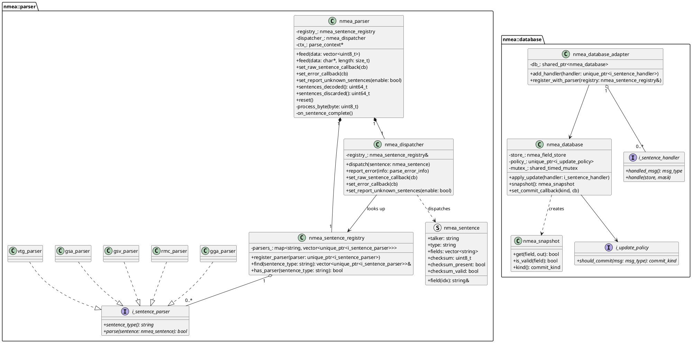
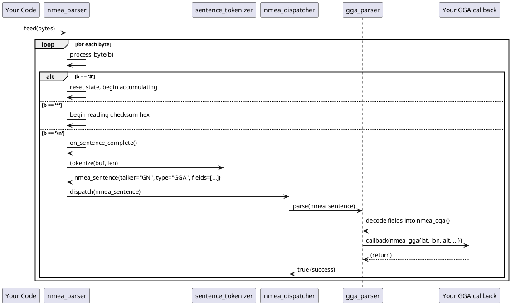

# NMEA 0183 Protocol & nmea_parser — Workshop Documentation

> **Target audience:** GNSS newcomers — developers new to location services who want to understand the NMEA 0183 ASCII sentence protocol and quickly integrate the `nmea_parser` C++ library.

---

## Table of Contents

### Part 1 — NMEA 0183 Protocol: Theory
1. [What is NMEA 0183?](#1-what-is-nmea-0183)
2. [NMEA Sentence Structure](#2-nmea-sentence-structure)
3. [Talker IDs and Sentence Types](#3-talker-ids-and-sentence-types)
4. [Data Field Conventions](#4-data-field-conventions)
5. [Checksum Algorithm — XOR](#5-checksum-algorithm--xor)
6. [Communication Interface Basics](#6-communication-interface-basics)
7. [Key Concepts Glossary](#7-key-concepts-glossary)

### Part 2 — nmea_parser Library: Developer Guide
8. [Library Overview](#8-library-overview)
9. [Architecture Overview](#9-architecture-overview)
10. [Quick Start: Parsing Your First Sentence](#10-quick-start-parsing-your-first-sentence)
11. [Feeding Data into the Parser](#11-feeding-data-into-the-parser)
12. [Registering Sentence Handlers / Callbacks](#12-registering-sentence-handlers--callbacks)
13. [Accessing Decoded Sentence Fields](#13-accessing-decoded-sentence-fields)
14. [The Database Layer — Epoch Snapshots](#14-the-database-layer--epoch-snapshots)
15. [Error Handling](#15-error-handling)
16. [Integration Examples](#16-integration-examples)
17. [Common Pitfalls & Tips](#17-common-pitfalls--tips)

---

---

# Part 1 — NMEA 0183 Protocol: Theory

> This part is a simplified, beginner-friendly reference based on the NMEA 0183 standard. Read it first to understand what NMEA 0183 is, why it exists, and how its sentences are structured — before exploring the `nmea_parser` library.

---

## 1. What is NMEA 0183?

> NMEA 0183 is a standard text-based protocol for communication between navigation devices (particularly GNSS/GPS receivers) and host computers. The name comes from the National Marine Electronics Association, which originally defined the standard.

### The problem it solves

Imagine a GNSS chip soldered to a circuit board. It continuously computes your position, speed, and time from satellite signals. Your application needs that data, but how should the chip communicate it?

It sends characters over a serial wire. Without an agreed format, those characters are meaningless. **NMEA 0183 is the agreed language** — a text protocol that defines precisely how each sentence is formatted, so both sides can reliably exchange data.

> **Analogy:** NMEA 0183 is like a standardised CSV report format. Every row (sentence) has clearly labelled columns, so any program that knows the format can read the data — even from a device it has never seen before.

### NMEA 0183 vs. UBX — which should you use?

Both protocols are used with u-blox GNSS receivers. They serve different purposes:

| Aspect | NMEA 0183 | UBX (u-blox binary) |
|---|---|---|
| Format | ASCII text — human-readable | Binary — compact and machine-readable |
| Primary purpose | Navigation data output | Full receiver control + rich data output |
| Can configure the receiver | **No** — output only | **Yes** — the only way on u-blox chips |
| Data richness | Moderate (position, velocity, time) | Very high (raw measurements, survey data, IMU fusion) |
| Interoperability | Works with any NMEA-compatible tool | u-blox specific |
| Parser complexity | Simple string splitting | Requires a binary state machine |
| Bandwidth | 3–4× larger than equivalent UBX | Compact binary |

**Use NMEA 0183 when:**
- You need human-readable output for debugging.
- A third-party tool (e.g., mapping software, GIS platform) requires NMEA input.
- You need only basic position, speed, and heading data.
- You are integrating with a multi-vendor system where receiver independence matters.

**Use UBX when:**
- You must configure the receiver (message rates, port settings, power modes, etc.).
- You need high-rate, high-precision data (carrier phase, accuracy estimates, raw measurements).
- You are writing production firmware where efficiency and determinism matter.

> **Key takeaway:** On u-blox receivers, NMEA 0183 is a standard output format. Configuration still requires UBX. Many production systems use both: UBX to configure the chip at startup, and NMEA to read the data stream.

---

## 2. NMEA Sentence Structure

### Every NMEA sentence looks the same on the outside

No matter what data is inside, every NMEA 0183 sentence follows the same character layout. Once you understand the structure of one sentence, you can read any of them.

### Anatomy of a sentence

Here is a complete, real-world NMEA sentence from a u-blox ZED-F9R receiver:

```
$GNGGA,092725.00,4717.11399,N,00833.91590,E,1,08,1.01,499.6,M,48.0,M,,*47\r\n
```

Let's break it down character by character:

```
GN: Talker ID (GN = multi-constellation)
GGA: Sentence type (GGA = position fix)
092725.00: UTC time
4717.11399,N: Latitude
00833.91590,E: Longitude
1: Fix quality (1 = GPS fix)
08: Satellites used
1.01: HDOP
499.6,M: Altitude (499.6 meters above mean sea level)
48.0,M: Geoid separation (48.0 meters)
(empty): DGPS age (not used)
(empty): DGPS station ID (not used)
*47: Checksum (XOR of all characters between '$' and '*')
\r\n: Line terminator (carriage return + line feed)
```

### Visual diagram of sentence fields

```
┌───┬──────────┬──────────────┬───┬──────────────────────────────┬───┬────┬────────┐
│ $ │ Talker   │ Sentence Type│ , │   Comma-separated data fields│ * │ CS │ \r\n   │
└───┴──────────┴──────────────┴───┴──────────────────────────────┴───┴────┴────────┘
  1      2-3         3-5       1            variable               1    2      2
```

### Field-by-field description

| Field | Characters | Example | Description |
|---|---|---|---|
| **Start delimiter** | `$` | `$` | Marks the beginning of a sentence. Every sentence starts with exactly one `$`. |
| **Talker ID** | 2 (or 1 for proprietary) | `GN` | Identifies which navigation system or device produced the sentence. |
| **Sentence type** | 3 | `GGA` | Identifies the sentence format and what data it contains. |
| **Data fields** | Variable | `092725.00,...` | Comma-separated values. Empty commas (`,,`) represent optional or unavailable fields. |
| **Checksum delimiter** | `*` | `*` | Separates the data from the checksum. |
| **Checksum** | 2 hex digits | `47` | XOR of all characters between `$` and `*`. Used to catch transmission errors. |
| **Line terminator** | `\r\n` | `\r\n` | Carriage return + Line feed. Always present at the end of a sentence. |

### Key rules

- Maximum sentence length: **82 characters** (including `$` and `\r\n`), per the standard.
  Some extended proprietary sentences (e.g., u-blox `PUBX`) may exceed this limit.
- The checksum is **always two uppercase hex digits** (e.g., `3A`, `0F`, `47`).
- Fields are **always separated by commas**, even when empty.
- The **`$`, `*`, and `\r\n`** are not data — they are framing characters.

---

## 3. Talker IDs and Sentence Types

### What is a Talker ID?

A Talker ID is a 2-character code at the start of every NMEA sentence (just after `$`).  
It identifies which navigation system or device is the source of the sentence.

> **Analogy:** Think of a Talker ID like a radio call sign. It tells you who is speaking before you listen to what they say.

### Table of common Talker IDs

| Talker ID | System | Example sentences |
|---|---|---|
| `GP` | GPS (US satellite navigation system) | `$GPGGA`, `$GPRMC` |
| `GL` | GLONASS (Russian satellite navigation system) | `$GLGSV` |
| `GA` | Galileo (European satellite navigation system) | `$GAGSV` |
| `GB` | BeiDou (Chinese satellite navigation system) | `$GBGSV` |
| `GQ` | QZSS (Japanese regional navigation system) | `$GQGSV` |
| `GN` | Combined GNSS (data blended from multiple constellations) | `$GNGGA`, `$GNRMC` |
| `II` | Integrated Instrumentation | `$IIHDG` |
| `P` | Proprietary (manufacturer-specific) | `$PUBX,...` |

> **Tip:** Modern multi-constellation receivers (e.g., u-blox ZED-F9R) typically output `GN` sentences when the fix uses satellites from more than one constellation. Your code must handle both `GP` and `GN` variants.

### What is a Sentence Type?

A Sentence Type is a 3-character code that immediately follows the Talker ID.  
It defines the **structure and meaning** of all the data fields that follow.

> **Analogy:** If the Talker ID is the speaker, the Sentence Type is the topic of the announcement — "position update", "satellite status", "course and speed", etc.

### Table of well-known sentence types

| Type | Full name | What it contains |
|---|---|---|
| `GGA` | Global Positioning System Fix Data | Position, altitude, fix quality, satellite count, HDOP |
| `RMC` | Recommended Minimum Specific GNSS Data | Position, speed, course, date/time, status |
| `GSA` | GNSS DOP and Active Satellites | Fix mode, DOP values (PDOP/HDOP/VDOP), active satellite IDs |
| `GSV` | GNSS Satellites in View | Per-satellite: PRN, elevation, azimuth, SNR |
| `GLL` | Geographic Position Latitude/Longitude | Position only, with status |
| `VTG` | Course Over Ground and Ground Speed | Speed (knots + km/h) and course (true + magnetic) |
| `GNS` | GNSS Fix Data | Multi-constellation position fix with mode indicators |
| `ZDA` | Time and Date | Full UTC date and time with timezone offset |
| `GBS` | GNSS Satellite Fault Detection | Error estimates for lat/lon/alt |
| `GST` | GNSS Pseudo Range Error Statistics | Position error statistics (RMS) |
| `DTM` | Datum Reference | Local datum and offset from WGS84 |
| `TXT` | Text Transmission | Human-readable device text messages |

### Examples of complete sentences

```
# GGA — Position fix (GPS only)
$GPGGA,123519,4807.038,N,01131.000,E,1,08,0.9,545.4,M,46.9,M,,*47\r\n

# GGA — Position fix (Combined GNSS, from a u-blox ZED-F9R)
$GNGGA,092725.00,4717.11399,N,00833.91590,E,1,08,1.01,499.6,M,48.0,M,,*6A\r\n

# RMC — Minimum navigation data
$GNRMC,092725.00,A,4717.11399,N,00833.91590,E,0.004,77.52,160223,,,A*60\r\n

# GSV — GPS satellites in view (part 1 of 2)
$GPGSV,2,1,05,21,40,083,46,05,35,141,47,25,42,057,50,46,38,103,34*74\r\n

# GSV — GPS satellites in view (part 2 of 2)
$GPGSV,2,2,05,16,08,320,19*40\r\n

# GSA — DOP and active satellites
$GNGSA,A,3,21,05,25,46,16,,,,,,,,1.5,0.9,1.2,1*3A\r\n

# VTG — Speed and course
$GNVTG,77.52,T,,M,0.004,N,0.007,K,A*3F\r\n

# ZDA — Date and time
$GNZDA,092725.00,16,02,2023,00,00*7D\r\n
```

---

## 4. Data Field Conventions

### How to read a sentence field definition table

Every sentence type has a fixed field layout. Documentation tables list each field with:
- Its **zero-based index** (position after the sentence identifier).
- The **format string** describing the expected content.
- Whether the field is **mandatory** or **optional** (empty when unavailable).

Example: GGA sentence field table

```
$--GGA,hhmmss.ss,llll.ll,a,yyyyy.yy,a,x,xx,x.x,x.x,M,x.x,M,x.x,xxxx*hh
```

| Index | Format | Name | Description |
|---|---|---|---|
| 0 | `hhmmss.ss` | UTC time | Hour, minute, second in UTC |
| 1 | `llll.ll` | Latitude | Degrees and decimal minutes (DDmm.mmmm) |
| 2 | `a` | N/S indicator | `N` = North, `S` = South |
| 3 | `yyyyy.yy` | Longitude | Degrees and decimal minutes (DDDmm.mmmm) |
| 4 | `a` | E/W indicator | `E` = East, `W` = West |
| 5 | `x` | Fix quality | 0=invalid, 1=GPS, 2=DGPS, 4=RTK fixed, 5=RTK float |
| 6 | `xx` | Satellites used | Number of satellites in the solution (0–12+) |
| 7 | `x.x` | HDOP | Horizontal dilution of precision |
| 8 | `x.x` | Altitude MSL | Height above mean sea level [metres] |
| 9 | `M` | Altitude units | Always `M` (metres) |
| 10 | `x.x` | Geoid separation | Difference between ellipsoid and geoid [metres] |
| 11 | `M` | Geoid units | Always `M` (metres) |
| 12 | `x.x` | DGPS age | Age of differential correction data [seconds]; empty if unused |
| 13 | `xxxx` | DGPS station ID | Reference station ID; empty if unused |

### Common field formats

#### UTC time — `hhmmss.ss`

The time field is a single decimal number encoding hours, minutes, and seconds:

```
092725.00  →  09 hours, 27 minutes, 25.00 seconds (UTC)
```

Unpack it like this:

```cpp
double utc_time = 92725.00;
int    hour   = (int)(utc_time / 10000);        // 9
int    minute = (int)(fmod(utc_time, 10000) / 100); // 27
double second = fmod(utc_time, 100.0);           // 25.00
```

> **Note:** The value is in UTC, not local time. Always display it accordingly.

#### Latitude / Longitude — DDDMM.MMMM format

This is the most commonly misread NMEA format. It is **not** decimal degrees.

The format encodes **degrees and decimal minutes** as a single number:

```
4717.11399  →  47 degrees, 17.11399 minutes
```

The integer part divided by 100 gives the degrees:
```
4717.11399 / 100 = 47.1711399  →  floor = 47 degrees
```

The fractional remainder (after removing the degrees × 100) gives decimal minutes:
```
4717.11399 − 47 × 100 = 17.11399 minutes
```

Convert to decimal degrees:

```
decimal_degrees = degrees + minutes / 60
                = 47 + 17.11399 / 60
                = 47.285233°
```

With a direction indicator:
- `N` (North) → positive value
- `S` (South) → negate the value
- `E` (East) → positive value
- `W` (West) → negate the value

C++ conversion example:

```cpp
// raw = "4717.11399", dir = "N"
double raw = 4717.11399;
double degrees = std::floor(raw / 100.0);         // 47.0
double minutes = raw - degrees * 100.0;           // 17.11399
double decimal_degrees = degrees + minutes / 60.0; // 47.285233
// direction 'N' → positive, 'S' → negative
```

> **Warning:** Never treat `4717.11399` as `47.1711399°` decimal degrees — that is approximately 0.8 km off. Always split at the degree boundary first.

#### UTC date — `ddmmyy`

```
160223  →  day=16, month=02, year=2023
```

#### Status character — `A` / `V`

Many sentences include a single-character status:
- `A` = **Active** (data is valid)
- `V` = **Void** (data is invalid — no fix or receiver warning)

> **Always check this field before using position data from RMC or GLL sentences.**

#### Mode indicator — `A`, `D`, `E`, `N`, `S`

Present in RMC, VTG, and GLL sentences (NMEA 2.3+):

| Character | Meaning |
|---|---|
| `A` | Autonomous GNSS fix |
| `D` | Differential GNSS fix (DGPS/SBAS) |
| `E` | Estimated / dead reckoning |
| `M` | Manual input mode |
| `N` | Data not valid |
| `S` | Simulator |

#### Empty / optional fields

Many fields are only populated when data is available. When the receiver has no fix, optional fields are empty. The commas are still present as placeholders:

```
$GNGGA,000000.00,,,,,,0,00,99.0,,,,,,*68\r\n
                ││││               ↑↑
              empty latitude     empty DGPS fields
```

> **Always guard against empty fields before parsing their content.** An empty latitude field does not mean zero degrees — it means the field is unavailable.

---

## 5. Checksum Algorithm — XOR

### Why checksums matter

When bytes travel over a serial wire, electrical interference can flip a bit. The NMEA 0183 XOR checksum is a simple but effective test that catches most single-bit transmission errors.

### Which characters are included

The checksum is computed over **all characters strictly between `$` and `*`** — both delimiters are excluded.

```
$GNRMC,092725.00,A,4717.11399,N,00833.91590,E,0.004,77.52,160223,,,A*60\r\n
 ├─────────────────────────────────────────────────────────────────┤
                     XOR all these characters
```

### The algorithm: step-by-step

1. Start with an accumulator set to `0`.
2. For each character between `$` and `*`, XOR the accumulator with that character's ASCII value.
3. The final accumulator value is the checksum.
4. Format it as **two uppercase hexadecimal digits** (e.g., `5` → `05`, `96` → `60`).

```cpp
uint8_t compute_checksum(const char* sentence)
{
    uint8_t cs = 0u;
    // Skip leading '$'
    const char* p = (*sentence == '$') ? sentence + 1 : sentence;
    // XOR until '*' or end of string
    while (*p && *p != '*')
        cs ^= static_cast<uint8_t>(*p++);
    return cs;
}
```

### Worked example

Sentence: `$GPGGA,123519,4807.038,N,01131.000,E,1,08,0.9,545.4,M,46.9,M,,*47`

Content between `$` and `*`: `GPGGA,123519,4807.038,N,01131.000,E,1,08,0.9,545.4,M,46.9,M,,`

XOR computation:

```
'G'=0x47
0x47 ^ 'P'(0x50) = 0x17
0x17 ^ 'G'(0x47) = 0x50
0x50 ^ 'G'(0x47) = 0x17
0x17 ^ 'A'(0x41) = 0x56
0x56 ^ ','(0x2C) = 0x7A
... (continuing for all characters) ...
final result = 0x47  →  formatted as "47"  ✓
```

> **Tip:** A checksum failure does not necessarily mean the sentence is unusable — some legacy devices omit the checksum entirely. However, if a checksum is present and wrong, the sentence should be discarded.

---

## 6. Communication Interface Basics

### Physical layer — UART serial

NMEA 0183 was designed for RS-232 serial communication, but on modern embedded hardware it typically uses **TTL-level UART** (3.3V or 5V logic).

The key parameters:
- **Baud rate:** The standard default is **4800 baud**. Modern GNSS receivers typically default to **9600** or **115200** baud and can be configured via UBX commands.
- **Data format:** 8 data bits, No parity, 1 stop bit (**8N1**) — the universal default.
- **Flow control:** None (hardware flow control is not used for NMEA output).

### Periodic sentences

By default, a GNSS receiver outputs a bundle of NMEA sentences once per second (1 Hz). Each bundle (one navigation epoch) typically contains:

```
$GNGGA,...  ← position fix
$GNRMC,...  ← minimum navigation data
$GNGSA,...  ← DOP and active satellites
$GPGSV,...  ← GPS satellites in view (may be multiple sentences)
$GLGSV,...  ← GLONASS satellites in view
$GNVTG,...  ← course and speed
```

Sentence output rates can be changed using UBX `CFG-MSG` or `CFG-VALSET` commands.

### Polling

Some sentence types can be polled on demand by sending a query sentence to the receiver. This is less common than periodic output and is not covered by this library.

### Proprietary sentences — `$P...`

When the Talker ID is the single character `P`, the sentence is proprietary — defined by the device manufacturer, not the NMEA standard.

u-blox uses `$PUBX,...` sentences for additional output that does not fit into standard NMEA frames. Third-party software generally does not understand proprietary sentences; only the manufacturer's documentation describes their format.

```
$PUBX,00,081350.00,4717.113210,N,00833.915187,E,546.589,G3,2.1,2.0,0.007,77.52,0.007,,18,18,18,0*7C\r\n
```

---

## 7. Key Concepts Glossary

| Term | Definition |
|---|---|
| **GNSS** | Global Navigation Satellite System — the umbrella term for all satellite navigation systems: GPS (US), GLONASS (Russia), Galileo (EU), BeiDou (China), QZSS (Japan). |
| **NMEA 0183** | A text-based standard protocol for communication between navigation instruments. Defined by the National Marine Electronics Association. |
| **Talker ID** | Two-character code identifying the source system of an NMEA sentence (e.g., `GP` = GPS, `GN` = multi-constellation). |
| **Sentence type** | Three-character code identifying the format and content of an NMEA sentence (e.g., `GGA`, `RMC`). |
| **Fix** | A computed position solution based on signals from two or more satellites. A fix is valid when the receiver has enough satellite geometry to compute a reliable position. |
| **UTC** | Coordinated Universal Time — the world's primary time standard. GNSS receivers output time in UTC. |
| **Epoch** | One complete navigation update cycle. Typically corresponds to one second's worth of NMEA sentences from a receiver. |
| **Latitude** | Angular distance north or south of the equator, measured in degrees (−90° to +90°). |
| **Longitude** | Angular distance east or west of the prime meridian, measured in degrees (−180° to +180°). |
| **Altitude / Height** | Vertical position. NMEA GGA reports altitude above mean sea level (MSL). |
| **DOP** | Dilution of Precision — a dimensionless multiplier expressing the effect of satellite geometry on position accuracy. Lower is better. HDOP ≤ 2 is generally considered good. |
| **HDOP** | Horizontal DOP — affects horizontal (lat/lon) accuracy. |
| **VDOP** | Vertical DOP — affects vertical (altitude) accuracy. |
| **PDOP** | Position (3D) DOP — combined 3D accuracy factor. |
| **Satellite / SV** | Space Vehicle — a single satellite in a GNSS constellation. Identified by its PRN or SV ID number. |
| **PRN** | Pseudo-Random Noise — the code identifier assigned to each satellite. Used as a satellite ID in NMEA sentences. |
| **SNR / C/N₀** | Signal-to-Noise Ratio — signal strength of a satellite, measured in dBHz (roughly 0–50). Higher = stronger signal. Called `SNR` in NMEA, technically C/N₀. |
| **COG** | Course Over Ground — the actual direction of movement across the Earth's surface, measured in degrees from true north. |
| **SOG** | Speed Over Ground — the actual speed of movement across the Earth's surface, measured in knots or km/h. |
| **Magnetic variation** | The angular difference between true north and magnetic north at a given location. Changes with geography and time. |
| **Geoid separation** | The difference between the GPS ellipsoid height and the geoid (approximately mean sea level). Required to convert GPS ellipsoid height to MSL altitude. |
| **DGPS** | Differential GPS — a technique that uses reference stations to improve position accuracy below 1 metre. |
| **RTK** | Real-Time Kinematic — centimetre-level positioning using carrier phase measurements and a reference station. |
| **Dead reckoning** | Estimating current position from a previously known position, using speed, heading, and elapsed time — used when satellite signals are unavailable (e.g., in a tunnel). |

---

---

# Part 2 — nmea_parser Library: Developer Guide

> This part is a practical guide for integrating the `nmea_parser` C++ library into your application.
> It assumes you have read Part 1 and understand the basics of NMEA 0183 sentences.

---

## 8. Library Overview

### What does nmea_parser do?

`nmea_parser` is a production-grade C++ library that reads a raw byte stream (e.g., from a UART serial port) and extracts, validates, and decodes NMEA 0183 sentences from it.

You feed raw bytes in, and you receive decoded C++ structs with named fields (`latitude`, `speed_knots`, `fix_quality`, etc.) delivered via callbacks.

### Design philosophy

| Property | Description |
|---|---|
| **Streaming state machine** | Processes one byte at a time. No need to pre-split lines or buffer complete sentences. |
| **Noise tolerant** | Ignores non-NMEA bytes (e.g., interleaved UBX binary frames) and re-synchronises on the next `$`. |
| **Open/Closed design** | Adding support for a new sentence type requires only adding a new parser class. The core framework never changes. |
| **Multiple subscribers** | Multiple parsers (callbacks) can be registered for the same sentence type. |
| **Optional database layer** | For applications needing epoch-triggered snapshots and thread-safe reads, an optional `nmea_database` layer is provided on top of the parser. |
| **No dynamic allocation in hot path** | The framing state machine uses a fixed-size stack buffer. |

### Supported sentence types

| Sentence | Decoded struct | Header |
|---|---|---|
| `GGA` | `nmea_gga` | `sentences/nmea_gga.h` |
| `RMC` | `nmea_rmc` | `sentences/nmea_rmc.h` |
| `GSA` | `nmea_gsa` | `sentences/nmea_gsa.h` |
| `GSV` | `nmea_gsv` | `sentences/nmea_gsv.h` |
| `VTG` | `nmea_vtg` | `sentences/nmea_vtg.h` |
| `GLL` | `nmea_gll` | `sentences/nmea_gll.h` |
| `GNS` | `nmea_gns` | `sentences/nmea_gns.h` |
| `ZDA` | `nmea_zda` | `sentences/nmea_zda.h` |
| `GBS` | `nmea_gbs` | `sentences/nmea_gbs.h` |
| `GST` | `nmea_gst` | `sentences/nmea_gst.h` |
| `DTM` | `nmea_dtm` | `sentences/nmea_dtm.h` |

---

## 9. Architecture Overview

### High-level pipeline

```
┌──────────────────────────────────────────────────────────────────────────┐
│                         RAW SERIAL / UART STREAM                         │
│                 (may contain noise, UBX binary, partial bytes)           │
└─────────────────────────────┬────────────────────────────────────────────┘
                              │  feed(bytes) — one byte at a time
                              ▼
┌──────────────────────────────────────────────────────────────────────────┐
│                           nmea_parser                                    │
│                                                                          │
│   State machine:                                                         │
│     wait_dollar ──→ accumulate_sentence ──→ wait_checksum_hi             │
│           ↑               │                      │                       │
│           │         sentence_too_long         wait_checksum_lo           │
│           │         unexpected_start               │                     │
│           └───── discard_with_error ─────────  wait_lf                   │
│                                                    │                     │
│                                            on_sentence_complete()        │
└────────────────────────────────────────────────────┬─────────────────────┘
                                                     │  nmea_sentence
                                                     ▼
┌──────────────────────────────────────────────────────────────────────────┐
│                         sentence_tokenizer                               │
│         Splits raw buffer into: talker / sentence_type / fields[]        │
└────────────────────────────────────────────────────┬─────────────────────┘
                                                     │  nmea_sentence
                                                     ▼
┌──────────────────────────────────────────────────────────────────────────┐
│                          nmea_dispatcher                                 │
│                                                                          │
│   1. Fire raw_sentence_callback (if set)                                 │
│   2. Look up parsers by sentence_type in nmea_sentence_registry          │
│   3. Call each registered parser → typed callback                        │
│   4. On parse failure → report malformed_fields error                    │
│   5. If no parser found and report_unknown_ set → error callback         │
└────────────────────────────────────────────────────┬─────────────────────┘
                                                     │  decoded struct
                                                     ▼
                              ┌──────────────────────────────────────┐
                              │  Your callback (nmea_gga, nmea_rmc…) │
                              └──────────────────────────────────────┘
```

### Optional database layer

For applications that need epoch-triggered aggregation and thread-safe position reads:

```
                              ┌──────────────────────────────────────┐
                              │  nmea_database_adapter               │
                              │  (wires parsers → handlers → db)     │
                              └──────────────────┬───────────────────┘
                                                 │  apply_update()
                                                 ▼
                              ┌──────────────────────────────────────┐
                              │  nmea_database                       │
                              │  Field store (flat double array)     │
                              │  Update policy (commit triggers)     │
                              │  SharedMutex: write=parser thread,   │
                              │              read=any thread         │
                              └──────────────────┬───────────────────┘
                                                 │  commit_callback(nmea_snapshot)
                                                 ▼
                              ┌──────────────────────────────────────┐
                              │  nmea_snapshot (immutable copy)      │
                              │  High-priority: GGA / RMC commit     │
                              │  Low-priority:  GSV commit           │
                              └──────────────────────────────────────┘
```

### Key classes and their responsibilities

| Class | Header | Responsibility |
|---|---|---|
| `nmea_parser` | `nmea_parser.h` | Top-level API. Framing state machine. Feeds bytes, triggers dispatch. |
| `nmea_sentence_registry` | `nmea_sentence_registry.h` | Owns registered `i_sentence_parser` instances. Allows multiple parsers per type. |
| `nmea_dispatcher` | `nmea_dispatcher.h` | Routes a framed `nmea_sentence` to its registered parsers and callbacks. |
| `nmea_sentence` | `sentences/nmea_sentence.h` | Tokenised intermediate representation: `talker`, `type`, `fields[]`, `checksum`. |
| `i_sentence_parser` | `parsers/i_sentence_parser.h` | Interface for per-type parsers. Implement to support a new sentence type. |
| `gga_parser`, `rmc_parser`, … | `parsers/*.h` | Concrete parsers. Each converts `nmea_sentence` fields into a typed struct and fires a callback. |
| `nmea_database` | `database/nmea_database.h` | Thread-safe flat field store. Aggregates multiple sentence types into one data set. |
| `nmea_database_adapter` | `database/nmea_database_adapter.h` | Connects parser callbacks to database handlers. |
| `nmea_snapshot` | `database/nmea_snapshot.h` | Immutable copy of the field store. Delivered to commit callbacks. |

### PlantUML class diagram



### PlantUML sequence diagram — parsing one sentence



---

## 10. Quick Start: Parsing Your First Sentence

### Minimal working example

The following complete program registers a GGA and RMC callback, feeds a simulated NMEA stream, and prints position data:

```cpp
#include "nmea_parser.h"
#include "nmea_sentence_registry.h"
#include "parsers/gga_parser.h"
#include "parsers/rmc_parser.h"
#include "nmea_errors.h"

#include <cstdio>
#include <memory>
#include <vector>
#include <string>
#include <cstdint>

using namespace nmea::parser;

// Helper: compute NMEA XOR checksum and return a complete sentence string
static std::vector<uint8_t> make_sentence(const std::string& body)
{
    uint8_t cs = 0u;
    for (char c : body)
        cs ^= static_cast<uint8_t>(c);

    char checksum_str[8];
    std::snprintf(checksum_str, sizeof(checksum_str), "*%02X\r\n",
                  static_cast<unsigned>(cs));

    std::string full = "$" + body + checksum_str;
    return std::vector<uint8_t>(full.begin(), full.end());
}

int main()
{
    // 1. Create the registry
    nmea_sentence_registry registry;

    // 2. Register a GGA callback
    registry.register_parser(
        std::unique_ptr<gga_parser>(
            new gga_parser([](const nmea_gga& g) {
                if (!g.valid) return;
                std::printf("GGA  talker=%-2s  lat=%+.6f  lon=%+.6f  "
                            "fix=%-d  sats=%d  alt=%.1f m\n",
                    g.talker.c_str(),
                    g.latitude, g.longitude,
                    static_cast<int>(g.fix_quality),
                    g.num_satellites,
                    g.altitude_msl);
            })));

    // 3. Register an RMC callback
    registry.register_parser(
        std::unique_ptr<rmc_parser>(
            new rmc_parser([](const nmea_rmc& r) {
                if (!r.valid) return;
                std::printf("RMC  status=%-6s  speed=%.3f kn  course=%.1f°\n",
                    r.status_active ? "ACTIVE" : "VOID",
                    r.speed_knots, r.course_true);
            })));

    // 4. Construct the parser with ownership of the registry
    nmea_parser parser(std::move(registry));

    // 5. Register an error callback
    parser.set_error_callback([](const parse_error_info& e) {
        std::printf("PARSE ERROR [%s]: %s\n",
            e.sentence_type.c_str(), e.description.c_str());
    });

    // 6. Feed a realistic burst (simulated u-blox ZED-F9R output)
    const auto gga = make_sentence(
        "GNGGA,092725.00,4717.11399,N,00833.91590,E,1,08,1.01,499.6,M,48.0,M,,");
    const auto rmc = make_sentence(
        "GNRMC,092725.00,A,4717.11399,N,00833.91590,E,0.004,77.52,160223,,,A");

    parser.feed(gga);
    parser.feed(rmc);

    std::printf("\nTotal decoded: %llu  discarded: %llu\n",
        (unsigned long long)parser.sentences_decoded(),
        (unsigned long long)parser.sentences_discarded());

    return 0;
}
```

**Expected output:**
```
GGA  talker=GN  lat=+47.285233  lon=+8.565265  fix=1  sats=8  alt=499.6 m
RMC  status=ACTIVE  speed=0.004 kn  course=77.5°
Total decoded: 2  discarded: 0
```

### Step-by-step walkthrough

| Step | What happens |
|---|---|
| **1. Create registry** | `nmea_sentence_registry` is the container for all your sentence parsers. |
| **2. Register callbacks** | For each sentence type you care about, create a typed parser (`gga_parser`, `rmc_parser`, …) and pass a callback lambda. Use `register_parser()` to transfer ownership. |
| **3. Create parser** | `nmea_parser` takes ownership of the registry via `std::move`. After this, the registry is inside the parser. |
| **4. Set error callback** | Optional but strongly recommended. The error callback receives `parse_error_info` for checksum failures, malformed fields, and buffer overflows. |
| **5. Feed bytes** | Call `parser.feed()` with any chunk of raw bytes — a single byte, a line, a full UART buffer. The internal state machine handles partial sentences and multi-sentence bursts. |
| **6. Callbacks fire** | Each registered callback fires synchronously inside `feed()` when a complete, valid sentence of the matching type arrives. |

---

## 11. Feeding Data into the Parser

### Two `feed()` overloads

```cpp
// Overload 1: vector of bytes (convenient for UART read buffers)
void feed(const std::vector<uint8_t>& data);

// Overload 2: raw char buffer (useful for reading from FILE* or socket)
void feed(const char* data, size_t length);
```

Both overloads process bytes one at a time through the internal state machine.

### How the byte-at-a-time state machine works

The parser is always in one of five states:

```
┌─────────────────────────────────────────────────────────────────────┐
│                                                                     │
│   wait_dollar  ──── '$' received ───→  accumulate_sentence          │
│       ↑                                       │                     │
│       │                    ',' '0-9' 'A-Z' … accumulated            │
│       │                                       │                     │
│       │                          '*' received │                     │
│       │                                       ▼                     │
│       │                               wait_checksum_hi              │
│       │                                       │                     │
│       │                           first hex digit received          │
│       │                                       ▼                     │
│       │                               wait_checksum_lo              │
│       │                                       │                     │
│       │                           second hex digit received         │
│       │                                       ▼                     │
│       │                                   wait_lf                   │
│       │                                       │                     │
│       │                              '\n' received                  │
│       │                                       │                     │
│       └──────── discard_with_error ───────── on_sentence_complete() │
│                                                                     │
└─────────────────────────────────────────────────────────────────────┘
```

| State | Description |
|---|---|
| `wait_dollar` | Discarding bytes (noise, UBX binary, etc.) until `$` arrives. |
| `accumulate_sentence` | Collecting content bytes into a fixed-size internal buffer, computing running XOR checksum. |
| `wait_checksum_hi` | Received `*`, waiting for the first hex digit of the checksum. |
| `wait_checksum_lo` | Waiting for the second hex digit. |
| `wait_lf` | Absorbs optional `\r`, then triggers `on_sentence_complete()` on `\n`. |

### Handling partial sentences

Because the state machine processes one byte at a time, it naturally handles sentences split across multiple `feed()` calls:

```cpp
// This works correctly — the sentence is split across two feed() calls
parser.feed({'$', 'G', 'N', 'G', 'G', 'A', ','});  // partial sentence
parser.feed({'0', '9', '2', '7', '2', '5', '.', '0', '0',
             ',', '4', '7', '1', '7', '.', '1', '1', '3', '9', '9',
             // ... rest of sentence bytes ...
             '*', '6', 'A', '\r', '\n'});
```

### Handling noise (UBX binary interleaved)

When UBX binary frames and NMEA sentences share the same UART port, UBX bytes appear as noise to the NMEA parser. The state machine silently discards all bytes in `wait_dollar` state until a `$` is found:

```
0xB5 0x62 0x01 0x07 ...  ← UBX bytes, silently ignored
$GNGGA,...                ← NMEA sentence, correctly parsed
```

### Buffer overflow protection

The internal accumulation buffer is `NMEA_BUFFER_LEN` bytes (256 bytes). If a sentence exceeds this length before a `*` or `\n` is seen, the parser fires a `sentence_too_long` error and resets to `wait_dollar`.

---

## 12. Registering Sentence Handlers / Callbacks

### The registration pattern

For every NMEA sentence type you want to decode, you:
1. Create a concrete parser instance (e.g., `gga_parser`) with a callback lambda.
2. Wrap it in `std::unique_ptr` and register it with `nmea_sentence_registry::register_parser()`.
3. The registry takes ownership.

```cpp
nmea_sentence_registry reg;

reg.register_parser(std::unique_ptr<gga_parser>(
    new gga_parser([](const nmea_gga& g) {
        // called for every GGA sentence (any talker: GP, GN, GA, ...)
    })));
```

### Talker-agnostic dispatch

Parsers are registered by **sentence type only** (`"GGA"`, `"RMC"`, etc.) — not by talker ID. A `gga_parser` registered for `"GGA"` will receive `$GPGGA`, `$GNGGA`, `$GAGGA`, and any other `??GGA` sentence. The `nmea_gga::talker` field tells you which talker produced it.

```cpp
reg.register_parser(std::unique_ptr<gga_parser>(
    new gga_parser([](const nmea_gga& g) {
        if (g.talker == "GN") {
            // Multi-constellation fix
        } else if (g.talker == "GP") {
            // GPS-only fix
        }
    })));
```

### Multiple subscribers for the same sentence type

Unlike many parser libraries, `nmea_sentence_registry` allows you to register **multiple parsers for the same sentence type**. All registered parsers are called in registration order:

```cpp
// Both will be called for every GGA sentence

// Subscriber 1: logging
reg.register_parser(std::unique_ptr<gga_parser>(
    new gga_parser([](const nmea_gga& g) {
        log_position(g.latitude, g.longitude);
    })));

// Subscriber 2: database update
reg.register_parser(std::unique_ptr<gga_parser>(
    new gga_parser([](const nmea_gga& g) {
        database.update_position(g);
    })));
```

### Example: subscribing to GGA (position and fix quality)

```cpp
#include "parsers/gga_parser.h"
#include "sentences/nmea_gga.h"

reg.register_parser(std::unique_ptr<gga_parser>(
    new gga_parser([](const nmea_gga& g) {
        if (!g.valid) return;  // always check validity first

        // Position quality check
        if (g.fix_quality == nmea::parser::gga_fix_quality::invalid) {
            std::printf("No fix yet.\n");
            return;
        }

        std::printf("Position: %.6f°%c, %.6f°%c\n",
            std::abs(g.latitude),  g.latitude  >= 0 ? 'N' : 'S',
            std::abs(g.longitude), g.longitude >= 0 ? 'E' : 'W');
        std::printf("Altitude: %.1f m MSL\n", g.altitude_msl);
        std::printf("HDOP: %.2f  Satellites: %d\n",
            g.hdop, g.num_satellites);
    })));
```

### Example: subscribing to RMC (speed and course)

```cpp
#include "parsers/rmc_parser.h"
#include "sentences/nmea_rmc.h"

reg.register_parser(std::unique_ptr<rmc_parser>(
    new rmc_parser([](const nmea_rmc& r) {
        if (!r.valid) return;
        if (!r.status_active) {  // 'V' = void — data may be unreliable
            std::printf("RMC: receiver warning — data void\n");
            return;
        }

        std::printf("Speed: %.2f knots (%.2f km/h)\n",
            r.speed_knots, r.speed_knots * 1.852);
        std::printf("Course: %.1f° true\n", r.course_true);

        // Decode UTC date: ddmmyy stored as integer 160223
        uint32_t d = r.date;
        int day   = d / 10000;
        int month = (d % 10000) / 100;
        int year  = 2000 + (d % 100);
        std::printf("Date: %04d-%02d-%02d UTC\n", year, month, day);
    })));
```

### Example: subscribing to GSV (satellites in view)

GSV data arrives in groups of 1–4 satellite records per sentence, potentially spanning multiple sentences. The `msg_num` and `num_msgs` fields tell you how to reassemble the full list.

```cpp
#include "parsers/gsv_parser.h"
#include "sentences/nmea_gsv.h"

reg.register_parser(std::unique_ptr<gsv_parser>(
    new gsv_parser([](const nmea_gsv& g) {
        if (!g.valid) return;

        // Print header on first message in the set
        if (g.msg_num == 1u) {
            std::printf("--- GSV [%s]: %d sats in view ---\n",
                g.talker.c_str(), g.sats_in_view);
        }

        // Print each satellite record in this sentence
        for (uint8_t i = 0u; i < g.sat_count; ++i) {
            const auto& sv = g.satellites[i];
            std::printf("  SV#%3u  elev=%3d°  az=%3u°  SNR=%3d dBHz\n",
                sv.sv_id, sv.elevation, sv.azimuth, sv.snr);
        }
    })));
```

### Example: subscribing to GSA (DOP values)

```cpp
#include "parsers/gsa_parser.h"
#include "sentences/nmea_gsa.h"

reg.register_parser(std::unique_ptr<gsa_parser>(
    new gsa_parser([](const nmea_gsa& g) {
        if (!g.valid) return;

        const char* fix_str = "no fix";
        if (g.nav_mode == nmea::parser::gsa_nav_mode::fix_2d) fix_str = "2D fix";
        if (g.nav_mode == nmea::parser::gsa_nav_mode::fix_3d) fix_str = "3D fix";

        std::printf("GSA  %-6s  PDOP=%.1f  HDOP=%.1f  VDOP=%.1f\n",
            fix_str, g.pdop, g.hdop, g.vdop);
    })));
```

### Raw sentence callback

For logging, debugging, or forwarding, you can register a raw callback that fires for **every successfully framed sentence**, before type-specific dispatch:

```cpp
parser.set_raw_sentence_callback([](const nmea_sentence& s) {
    std::printf("RAW  $%s%s  fields=%zu  cs_valid=%s\n",
        s.talker.c_str(), s.type.c_str(),
        s.fields.size(),
        s.checksum_valid ? "yes" : "no");
});
```

---

## 13. Accessing Decoded Sentence Fields

### Field naming conventions

All decoded structs follow consistent field naming:

| Convention | Meaning | Example |
|---|---|---|
| `talker` | The 2-char talker ID | `"GN"`, `"GP"`, `"GL"` |
| `utc_time` | Time as double `hhmmss.ss` | `92725.00` |
| `latitude` | Decimal degrees, negative = South | `47.285233` |
| `longitude` | Decimal degrees, negative = West | `8.565265` |
| `status_active` | `true` = active/valid, `false` = void | `true` |
| `valid` | `true` if all mandatory fields decoded | `true` |
| `_knots`, `_kmh` | Speed unit suffixes | `speed_knots`, `speed_kmh` |
| `_msl` | Altitude above mean sea level | `altitude_msl` |
| Field `-1.0` convention | Optional double field unavailable | `dgps_age = -1.0` |

### The `valid` flag

Every decoded struct has a `bool valid` member. It is `true` only if all mandatory fields in the sentence were successfully decoded.

> **Always check `valid` before using any other field.** A sentence can arrive with a valid checksum but have missing or malformed data fields.

```cpp
new gga_parser([](const nmea_gga& g) {
    if (!g.valid) return;  // ← do this first
    use(g.latitude, g.longitude);
})
```

### Latitude and longitude

The library fully converts NMEA `DDmm.mmmm` format to decimal degrees for you. The direction indicator is absorbed into the sign:

| Raw NMEA | Direction | Stored value |
|---|---|---|
| `4717.11399` | `N` | `+47.285233` (North = positive) |
| `4717.11399` | `S` | `−47.285233` (South = negative) |
| `00833.91590` | `E` | `+8.565265` (East = positive) |
| `00833.91590` | `W` | `−8.565265` (West = negative) |

**You do not need to do any further conversion.** The `latitude` and `longitude` fields are already in standard decimal degrees, ready to use with mapping libraries or geographic calculations.

### UTC time decoding

The `utc_time` field stores the raw `hhmmss.ss` value as a `double` (e.g., `92725.0` for 09:27:25 UTC). To get structured hours/minutes/seconds:

```cpp
double t = g.utc_time;                     // e.g. 92725.00
int    hour   = static_cast<int>(t / 10000.0);               // 9
int    minute = static_cast<int>(std::fmod(t, 10000.0) / 100.0); // 27
double second = std::fmod(t, 100.0);       // 25.00
```

### Optional / empty fields

Some fields are only present when the receiver has certain data. They use sentinel values:

| Field type | Sentinel | Meaning |
|---|---|---|
| `double dgps_age` | `−1.0` | DGPS correction not in use |
| `double mag_variation` | `0.0` | Magnetic variation unavailable |
| `int8_t snr` in `gsv_satellite` | `−1` | Satellite not being tracked |
| `int8_t elevation` in `gsv_satellite` | `−1` | Elevation unavailable |

```cpp
// Check before using optional fields
if (g.dgps_age >= 0.0) {
    std::printf("DGPS age: %.1f s\n", g.dgps_age);
}
```

### GGA fix quality enum

```cpp
enum class gga_fix_quality : uint8_t {
    invalid    = 0,  // No valid fix
    gps_sps    = 1,  // Standard GPS fix
    dgps       = 2,  // Differential GPS fix
    pps        = 3,  // PPS fix
    rtk_fixed  = 4,  // RTK fixed integer (centimetre-level)
    rtk_float  = 5,  // RTK float solution
    estimated  = 6,  // Dead reckoning
    manual     = 7,  // Manual input
    simulation = 8,  // Simulation
};
```

### GSA navigation mode enum

```cpp
enum class gsa_nav_mode : uint8_t {
    unknown = 0,
    no_fix  = 1,  // No satellite fix
    fix_2d  = 2,  // 2D fix (altitude fixed or assumed)
    fix_3d  = 3,  // Full 3D fix (most reliable)
};
```

---

## 14. The Database Layer — Epoch Snapshots

### When to use the database layer

The direct callback approach (Part 12) is ideal when you want to react to each individual sentence as it arrives. However, for many applications you need a **consistent, complete snapshot** of the latest navigation data — position, DOP, speed, and satellite info all from the same epoch.

The `nmea_database` layer solves this by:

1. Accumulating fields from multiple sentence types into a single flat store.
2. Applying a configurable **commit policy** to decide when to fire a snapshot callback.
3. Providing **thread-safe reads** via `nmea_snapshot::get()`, so your main thread can read the latest position while the parser thread continues feeding data.

### Commit triggers (update policy)

The default policy (`default_update_policy`) defines two commit kinds:

| Trigger | Kind | Sentences |
|---|---|---|
| GGA arrives | `high_priority` | Primary position fix (position, altitude, HDOP, fix quality) |
| Last GSV in a set arrives | `low_priority` | Satellite constellation update |
| All other sentences | `none` | Fields stored but no callback fired |

You receive the commit callback with an `nmea_snapshot` containing all fields accumulated up to that update.

### Complete database layer example

```cpp
#include "nmea_parser.h"
#include "nmea_sentence_registry.h"
#include "database/nmea_database.h"
#include "database/nmea_database_adapter.h"
#include "database/nmea_data_fields.h"
#include "database/handlers/db_gga_handler.h"
#include "database/handlers/db_rmc_handler.h"
#include "database/handlers/db_gsa_handler.h"
#include "database/handlers/db_gsv_handler.h"
#include "database/handlers/db_vtg_handler.h"

#include <memory>
#include <cstdio>

using namespace nmea::parser;
using namespace nmea::database;

// Helper function (same as quick-start example)
static std::vector<uint8_t> make_sentence(const std::string& body) { /* ... */ }

int main()
{
    // 1. Create the shared database
    auto db = std::make_shared<nmea_database>();

    // 2. Register high-priority commit callback (fires on GGA)
    db->set_commit_callback(commit_kind::high_priority,
        [](const nmea_snapshot& snap) {
            double lat = 0.0, lon = 0.0, alt = 0.0, hdop = 0.0;
            int    fix = 0,   nsats = 0;

            snap.get(NMEA_GGA_LATITUDE,       lat);
            snap.get(NMEA_GGA_LONGITUDE,      lon);
            snap.get(NMEA_GGA_ALTITUDE_MSL,   alt);
            snap.get(NMEA_GGA_HDOP,           hdop);
            snap.get(NMEA_GGA_FIX_QUALITY,    fix);
            snap.get(NMEA_GGA_NUM_SATELLITES, nsats);

            std::printf("[HP] lat=%.6f  lon=%.6f  alt=%.1fm  "
                        "hdop=%.2f  fix=%d  sats=%d\n",
                lat, lon, alt, hdop, fix, nsats);
        });

    // 3. Register low-priority commit callback (fires after last GSV in set)
    db->set_commit_callback(commit_kind::low_priority,
        [](const nmea_snapshot& snap) {
            int nsats_in_view = 0;
            snap.get(NMEA_GSV_NUM_SATS_IN_VIEW, nsats_in_view);
            std::printf("[LP] sats_in_view=%d\n", nsats_in_view);
        });

    // 4. Create registry and adapter, register handlers
    nmea_sentence_registry reg;
    nmea_database_adapter  adapter(db);

    adapter.add_handler(
        std::unique_ptr<i_sentence_handler>(new db_gga_handler()));
    adapter.add_handler(
        std::unique_ptr<i_sentence_handler>(new db_rmc_handler()));
    adapter.add_handler(
        std::unique_ptr<i_sentence_handler>(new db_gsa_handler()));
    adapter.add_handler(
        std::unique_ptr<i_sentence_handler>(new db_gsv_handler()));
    adapter.add_handler(
        std::unique_ptr<i_sentence_handler>(new db_vtg_handler()));

    // 5. Wire adapter into the parser registry
    adapter.register_with_parser(reg);

    // 6. Create parser
    nmea_parser parser(std::move(reg));

    // 7. Feed sentences
    parser.feed(make_sentence(
        "GNGGA,092725.00,4717.11399,N,00833.91590,E,4,12,0.5,499.6,M,48.0,M,,"));
    parser.feed(make_sentence(
        "GNRMC,092725.00,A,4717.11399,N,00833.91590,E,0.004,77.52,160223,,,A"));
    parser.feed(make_sentence(
        "GPGSV,2,1,08,21,40,083,46,05,35,141,47,25,42,057,50,46,38,103,34"));
    parser.feed(make_sentence(
        "GPGSV,2,2,08,12,10,020,35,30,55,200,42,11,25,342,28,07,05,089,22"));
    //           ↑ last part of GSV set — triggers low_priority commit

    return 0;
}
```

### Reading a snapshot from any thread

Because `nmea_database` uses `std::shared_timed_mutex` internally, you can call `snapshot()` safely from any thread while the parser thread feeds data:

```cpp
// Parser thread (feeding bytes)
//   parser.feed(uart_buffer);

// Main/UI thread (reading position)
nmea_snapshot snap = db->snapshot();
double lat = 0.0, lon = 0.0;
if (snap.get(NMEA_GGA_LATITUDE, lat) &&
    snap.get(NMEA_GGA_LONGITUDE, lon)) {
    update_map(lat, lon);
}
```

### Available field constants (`nmea_data_fields.h`)

| Constant | Type | Description |
|---|---|---|
| `NMEA_GGA_LATITUDE` | `double` | Decimal degrees |
| `NMEA_GGA_LONGITUDE` | `double` | Decimal degrees |
| `NMEA_GGA_ALTITUDE_MSL` | `double` | Metres above MSL |
| `NMEA_GGA_HDOP` | `double` | Horizontal DOP |
| `NMEA_GGA_FIX_QUALITY` | `double` (cast to int) | Fix quality (0–8) |
| `NMEA_GGA_NUM_SATELLITES` | `double` (cast to int) | Satellites used |
| `NMEA_RMC_LATITUDE` | `double` | Decimal degrees |
| `NMEA_RMC_LONGITUDE` | `double` | Decimal degrees |
| `NMEA_RMC_SPEED_KNOTS` | `double` | Speed over ground [knots] |
| `NMEA_RMC_COURSE_TRUE` | `double` | Course over ground [°] |
| `NMEA_RMC_STATUS_ACTIVE` | `double` | 1.0=active, 0.0=void |
| `NMEA_GSA_PDOP` | `double` | PDOP |
| `NMEA_GSA_HDOP` | `double` | HDOP from GSA |
| `NMEA_GSA_VDOP` | `double` | VDOP |
| `NMEA_GSA_NAV_MODE` | `double` (cast to int) | 1=no fix, 2=2D, 3=3D |
| `NMEA_VTG_SPEED_KNOTS` | `double` | Speed [knots] |
| `NMEA_VTG_SPEED_KMPH` | `double` | Speed [km/h] |
| `NMEA_VTG_COURSE_TRUE` | `double` | Course, true north [°] |
| `NMEA_GSV_NUM_SATS_IN_VIEW` | `double` (cast to int) | Total satellites in view |
| `NMEA_GSV_SAT_SVID` + idx | `double` (cast to int) | SV ID of satellite at index `idx` |
| `NMEA_GSV_SAT_SNR` + idx | `double` (cast to int) | SNR of satellite at index `idx` |
| `NMEA_ZDA_YEAR` | `double` | UTC year |
| `NMEA_ZDA_MONTH` | `double` | UTC month |
| `NMEA_ZDA_DAY` | `double` | UTC day |

For per-satellite fields, use the `nmea_gsv_sat_field()` helper:

```cpp
for (int i = 0; i < 64; ++i) {
    int svid = 0, snr = -1;
    if (!snap.get(nmea_gsv_sat_field(NMEA_GSV_SAT_SVID, i), svid)) break;
    snap.get(nmea_gsv_sat_field(NMEA_GSV_SAT_SNR, i), snr);
    std::printf("  SV#%3d  SNR=%3d dBHz\n", svid, snr);
}
```

---

## 15. Error Handling

### Error types

The library reports errors through the `parse_error_callback` (set via `parser.set_error_callback()`). Each error delivers a `parse_error_info` struct:

```cpp
struct parse_error_info {
    parse_error_code code;          // what went wrong
    std::string      talker;        // talker ID (may be empty)
    std::string      sentence_type; // sentence type (may be empty)
    std::string      description;   // human-readable description
};
```

### Error codes

| Code | Enum value | When fired | Action taken |
|---|---|---|---|
| `checksum_mismatch` | 1 | `*HH` present but computed XOR ≠ received value | Sentence discarded |
| `sentence_too_long` | 2 | Sentence exceeded 256-byte buffer | Sentence discarded, re-sync on next `$` |
| `unexpected_start_in_sentence` | 3 | `$` received before previous sentence terminated | Previous sentence discarded, new sentence started |
| `malformed_fields` | 4 | Sentence passed checksum but field count/content invalid | Error reported but sentence not decoded |
| `unknown_sentence_type` | 5 | No registered parser for sentence type | Only reported if `set_report_unknown_sentences(true)` |

### Error callback example

```cpp
parser.set_error_callback([](const nmea::parser::parse_error_info& e) {
    using Code = nmea::parser::parse_error_code;
    switch (e.code) {
    case Code::checksum_mismatch:
        std::printf("CHECKSUM FAIL on $%s%s: %s\n",
            e.talker.c_str(), e.sentence_type.c_str(),
            e.description.c_str());
        break;
    case Code::malformed_fields:
        std::printf("MALFORMED $%s%s: %s\n",
            e.talker.c_str(), e.sentence_type.c_str(),
            e.description.c_str());
        break;
    case Code::sentence_too_long:
        std::printf("BUFFER OVERFLOW: %s\n", e.description.c_str());
        break;
    default:
        std::printf("PARSE ERROR [%d]: %s\n",
            static_cast<int>(e.code), e.description.c_str());
        break;
    }
});
```

### Enabling unknown-sentence reporting

By default, sentences with no registered parser are silently passed to the raw callback only. To receive an error when an unrecognised sentence type arrives:

```cpp
parser.set_report_unknown_sentences(true);
```

### Statistics

You can query how many sentences have been processed:

```cpp
uint64_t ok      = parser.sentences_decoded();    // successfully decoded
uint64_t dropped = parser.sentences_discarded();  // checksum/framing failures
```

---

## 16. Integration Examples

### Example 1: UART read loop (embedded / Linux)

Feed bytes directly from a UART read into the parser:

```cpp
#include "nmea_parser.h"
#include "parsers/gga_parser.h"
#include "parsers/rmc_parser.h"
#include <unistd.h>   // read()
#include <fcntl.h>
#include <termios.h>

int open_uart(const char* port, int baud);  // platform-specific setup

int main()
{
    using namespace nmea::parser;

    nmea_sentence_registry reg;
    reg.register_parser(std::unique_ptr<gga_parser>(
        new gga_parser([](const nmea_gga& g) {
            if (g.valid && g.fix_quality != gga_fix_quality::invalid)
                std::printf("lat=%.6f lon=%.6f\n", g.latitude, g.longitude);
        })));

    nmea_parser parser(std::move(reg));
    parser.set_error_callback([](const parse_error_info& e) {
        std::fprintf(stderr, "nmea error: %s\n", e.description.c_str());
    });

    int fd = open_uart("/dev/ttyUSB0", 115200);
    uint8_t buf[256];

    while (true) {
        ssize_t n = ::read(fd, buf, sizeof(buf));
        if (n > 0)
            parser.feed(buf, static_cast<size_t>(n));
    }
}
```

### Example 2: Parse a recorded NMEA log file

```cpp
#include "nmea_parser.h"
#include "parsers/gga_parser.h"
#include "parsers/rmc_parser.h"
#include <cstdio>
#include <cstring>
#include <memory>

int main(int argc, char* argv[])
{
    if (argc < 2) {
        std::fprintf(stderr, "Usage: %s <nmea_log.txt>\n", argv[0]);
        return 1;
    }

    using namespace nmea::parser;

    nmea_sentence_registry reg;
    reg.register_parser(std::unique_ptr<gga_parser>(
        new gga_parser([](const nmea_gga& g) {
            if (!g.valid) return;
            std::printf("GGA  %.6f  %.6f  fix=%d  sats=%d\n",
                g.latitude, g.longitude,
                static_cast<int>(g.fix_quality), g.num_satellites);
        })));
    reg.register_parser(std::unique_ptr<rmc_parser>(
        new rmc_parser([](const nmea_rmc& r) {
            if (!r.valid || !r.status_active) return;
            std::printf("RMC  %.2f kn  %.1f°\n",
                r.speed_knots, r.course_true);
        })));

    nmea_parser parser(std::move(reg));

    FILE* f = std::fopen(argv[1], "rb");
    if (!f) { std::perror("fopen"); return 1; }

    char line[256];
    while (std::fgets(line, sizeof(line), f))
        parser.feed(line, std::strlen(line));

    std::fclose(f);

    std::printf("\nDecoded: %llu  Discarded: %llu\n",
        (unsigned long long)parser.sentences_decoded(),
        (unsigned long long)parser.sentences_discarded());
    return 0;
}
```

### Example 3: Constructing and sending a valid NMEA sentence

Although `nmea_parser` is a receiver-side library, you may need to construct outgoing NMEA sentences for testing or for devices that accept NMEA input. Here is a utility function:

```cpp
#include <cstdint>
#include <cstdio>
#include <string>
#include <vector>

/// Build a complete NMEA sentence string from the body (no $ or *HH).
/// Returns e.g. "$PUBX,40,GGA,0,1,0,0*5A\r\n"
std::string build_nmea_sentence(const std::string& body)
{
    uint8_t cs = 0u;
    for (unsigned char c : body)
        cs ^= c;

    char suffix[8];
    std::snprintf(suffix, sizeof(suffix), "*%02X\r\n",
                  static_cast<unsigned>(cs));
    return "$" + body + suffix;
}

// Example: enable GGA output on u-blox receiver (via PUBX proprietary sentence)
// std::string cmd = build_nmea_sentence("PUBX,40,GGA,0,1,0,0");
// uart_write(cmd.data(), cmd.size());
```

---

## 17. Common Pitfalls & Tips

### 1. Misreading the latitude/longitude format

**Problem:** The NMEA format `4717.11399` looks like a decimal number. It is **not** `47.1711399°` decimal degrees.

**Correct interpretation:**
```
4717.11399 → 47° 17.11399' → 47.285233° decimal degrees
```

**Solution:** Always use the library's decoded `latitude` and `longitude` fields from the typed structs — they are already in decimal degrees. Never convert the raw NMEA field string yourself unless you fully understand the format.

---

### 2. Using position data without checking the status field

**Problem:** The `status` field in RMC and GLL sentences can be `V` (Void) — meaning the receiver has no valid fix. If you ignore this, you will process stale or invalid coordinates.

**Correct approach:**
```cpp
new rmc_parser([](const nmea_rmc& r) {
    if (!r.valid) return;           // parse failed
    if (!r.status_active) return;   // 'V' = receiver warning
    use_position(r.latitude, r.longitude);
})
```

> **Rule:** Always check `valid` first, then check `status_active` for RMC and GLL. For GGA, check `fix_quality != gga_fix_quality::invalid`.

---

### 3. Hardcoding `GP` talker ID

**Problem:** Assuming all sentences come with a `GP` talker ID. Modern multi-constellation receivers output `GN` (combined), `GL` (GLONASS), `GA` (Galileo), and `GB` (BeiDou) prefixed sentences. A parser registered for `GGA` receives all of them, but filtering by `g.talker == "GP"` will miss most sentences from a modern receiver.

**Correct approach:** Register once for the sentence type and check `g.talker` in the callback if you need constellation-specific logic:

```cpp
new gga_parser([](const nmea_gga& g) {
    // Works for $GPGGA, $GNGGA, $GAGGA, etc.
    use_position(g.latitude, g.longitude);
})
```

---

### 4. Ignoring empty optional fields

**Problem:** Accessing an empty field (e.g., latitude when there is no fix) converts an empty string to `0.0`, placing you at the intersection of the equator and prime meridian (Gulf of Guinea, off Africa) — a silent, wrong result.

**Correct approach:** Check the `valid` flag and the sentinel values before using optional fields:

```cpp
if (g.valid && g.dgps_age >= 0.0) {
    // DGPS data is present
}
```

---

### 5. Mishandling GSV multi-sentence groups

**Problem:** GSV satellite data spans multiple sentences (up to 4 satellites per sentence). Reacting to the first GSV sentence gives you only a partial satellite list.

**Correct approach:** Use `msg_num` and `num_msgs` to detect the last sentence in the set:

```cpp
static std::vector<gsv_satellite> sat_buffer;

new gsv_parser([](const nmea_gsv& g) {
    if (!g.valid) return;
    if (g.msg_num == 1u)
        sat_buffer.clear();  // start of new set

    for (uint8_t i = 0u; i < g.sat_count; ++i)
        sat_buffer.push_back(g.satellites[i]);

    if (g.msg_num == g.num_msgs) {
        // All sentences in this set received — process complete list
        process_satellite_list(sat_buffer);
    }
})
```

Or use the `nmea_database` layer, which handles GSV accumulation automatically.

---

### 6. Not resetting after a connection drop

**Problem:** If the serial connection drops mid-sentence and reconnects, the parser may have a partial sentence in its internal buffer. The next `$` received will trigger an `unexpected_start_in_sentence` error and automatically recover — but calling `reset()` explicitly after a reconnection provides a clean start.

```cpp
void on_uart_reconnected() {
    parser.reset();  // clears buffer, resets state, zeros statistics
}
```

---

### 7. Blocking inside a callback

**Problem:** Callbacks fire **synchronously inside `feed()`**. If your callback does heavy work (file I/O, network calls, sleep), it will block the parser and back-pressure the UART buffer.

**Correct approach:** Keep callbacks fast. Buffer decoded data in a thread-safe queue and process it on a separate thread:

```cpp
// In the callback (parser thread) — fast
new gga_parser([&queue](const nmea_gga& g) {
    if (g.valid) queue.push(g);  // lock-free push
})

// On processing thread — slow work here
while (true) {
    nmea_gga g;
    if (queue.pop(g))
        heavy_processing(g);
}
```

---

### 8. High-rate streams and buffer overflow

**Problem:** At high baud rates (e.g., 115200 baud, 10 Hz update rate), many sentences may arrive between `feed()` calls. If your read buffer is too small or your callback is slow, the OS serial buffer can overflow.

**Tips:**
- Read in chunks (256–4096 bytes per `read()` call) and feed the entire chunk.
- Use the `sentence_too_long` error counter to detect buffer issues in the parser itself.
- Monitor `sentences_discarded()` periodically; a non-zero and growing value indicates problems.

---

### 9. Altitude: ellipsoid height vs. MSL

**Problem:** GGA reports altitude above mean sea level (MSL). The geoid separation field (`geoid_sep`) is the offset between the GPS ellipsoid and the geoid. If you need ellipsoid height (e.g., for precise RTK positioning):

```
ellipsoid_height = altitude_msl + geoid_sep
```

Most consumer navigation uses MSL altitude, which is what `altitude_msl` already provides.


